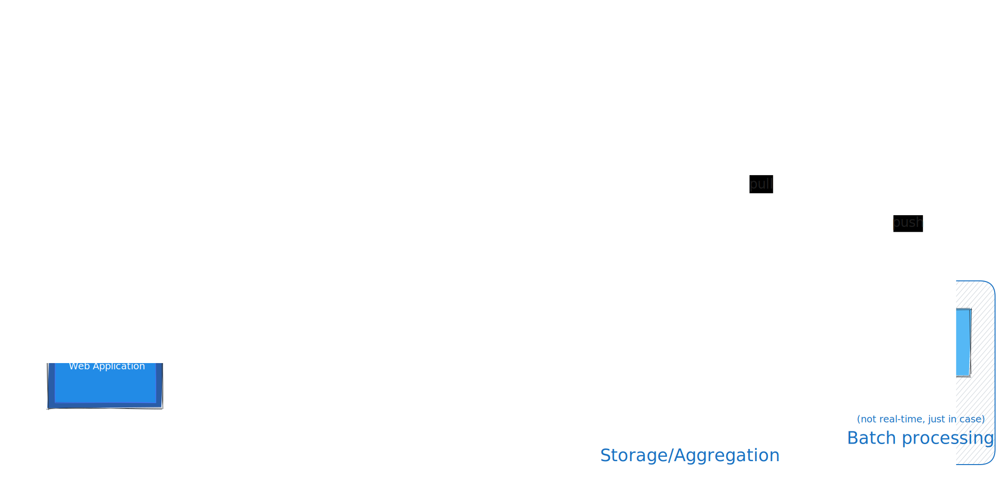

# 1-Task Near Real-Time processing aggregation, and visualization of analytics data.

## Overview

Data is sent from source (mobile app/web site) to collector, which is behind API Gateway.
Collector component receives messages/events, makes some validation or other checks and sends
to kafka queue.
Kafka sends messages/events to stream processor and Data Lake.
Stream Processor transforms/structures data and inserts data to DWH, in small bathes if needed.
As it is a NEAR real-time processing, it can insert into DWH with frequency of 10s times per second.
Grafana pulls data from DWH and shows analytics.
Data Lake is here for batch processing, just in case if will be needed for analytics, not for real time.
Worker pulls data from Data Lake, transforms, and pushes to Grafana

## Functional

1. Collect and ingest event data from user
2. Store data in case it is needed for analysis
3. Frontend/Grafana
4. Process and aggregate data in near real-time

## Non-Functional

1. Near Real-Time processing, 100ms
2. High throughput
3. Security

## Describing

Frameworks. Apache Spark looks more suitable for this task, bacause we need NEAR real time
processing and Spark uses micro-batching. But if we need truly real-time processing Flink or Kafka
streams would be more suitable. Spark and micro-batches are better for this design also because it
lets us use DWH. Spark supports both pull-based and push-based. In general push-based is better for real-time analytics. BUT, as we need NEAR real-time, I assume that native pull-based would be better if ~100ms delay is tolerable. Spark will pull when ready, and probably less resource consumption, no need to guarantee that all data is processed. It is easier.

Databases. I chose PostgreSQL because I am more familiar with it, and know it's limitations. There shouldn't be much difference across different SQL databases like Oracle, Postgres, or MySQL for this task. The main requirement here is data being stored in structured format, and transaction capabilities
Frontend visualization. Grafana here used for visualizations, to make understandable charts to monitoring.

## WHY?

API gateway was assumed as a part of entire system
Collector is needed to make sure that data came in expected form.
Kafka producers (collector) can scale independently from consumers, also kafka will buffer if processors can't keep up with sudden spike.
Data stored in DWH before Grafana, so that we would not lost that data.
Data Lake is not a part of task, but I decided to show it, because company may need it. Especially if they migrated from t-1.

## C4 diagram
