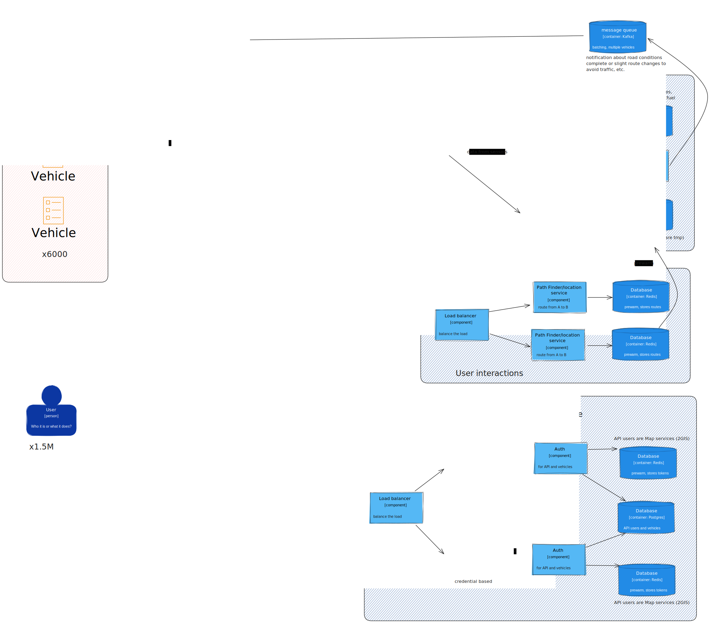

# 2-Task Self-driving vehicles requirements.
Teacher stated:

-Self-driving vehicle paths should not intersect with existing public transport system.

I do not agree, because:

If current Bus routes are overloaded, we need our self-drive buses to intersect with them, to divide the load, and only after that gracefully replace them. At least we need information at the beginning 

## General

1. Current bus count 3500 (Almaty)
2. 18 seat bus can transport 36-40 people
3. 1.5 M people per day.
4. 30% (500k) of users need 2GIS (or other app) to navigate with busses
5. Average time in bus is 15 minutes
6. 1.5 M / 18 / 15 ~= 5600 ~ 6000
7. To solve problem we need 6000 vehicles with 18 seats 
8. After some time self-driving vehicles will replace conventional buses

### Non-Functional Requirements

1. 500k users request path finding from A to B
2. 6000 vehicles send telemetry.
3. 15 minutes reaction time to road problems
4. Security, authentication
5. Rate-limiting in case 2GIS like services get DDOSed 
6. Uptime 99.99%
7. Fault-tolerance
8. Scalability

### Functional

1. Adapting to customer load, based on weight counting and payment numbers
2. API to external services to know vehicles location, get path to some point
3. Replace current transport
4. Adapt to road situations

### CAP
Availability has more priority than consistency. Vehicle may not have the most actual information, but it can reach destination, and handle at least some portion of load. 
If consistency would be prioritized, it would stop vehicles, during network partions, cause road accidents, problems with traffic and increasing load on public transport.
So, A > C

### Vehicle control system

1. Vehicle route can change
2. Vehicle can change only when active route is finished
3. Vehicles controlled by self-drive model like FSD (Tesla) model on the vehicle. It minimizes lags between Model and vehicle. This avoids network issues
4. Control system measures data from sensors, camera, LiDar, fuel/charge sensor, internal sensors and so on.
5. Data from sensors that are related to driving sent to a model continuously, streaming, so that model could have back-pressure.
6. Vehicle control system should have integration with Onay (payment system used to pay in public transport, provides cards)
7. Using integration with Onay we can measure number of new passengers from each stop.
8. Onay integration should use adapter pattern, as it is a third party API
9. Also vehicle needs pressure sensor on suspension, to approximately measure number of passengers, based on the mean weight.
10. If GPS is not available it can switch to inertial navigation for short term.
11. Raw data from cameras LiDars and other sensors are stored on the vehicle, encrypted, for limited amount of days. Either not stored at all.

Why to not store video and data from other sensors:

1080p video = 8 GB/h. 8 GB/h * 18 h * 6000 vehicles = 864 TB data per day. And that is only from camera. With 8x compression it is still 108 TB of data. Public transportation organization simply cannot afford that. We can increase compression rate, but then compressed data probably will not be useful. If we are worried about road accidents, we can send data to organizations like Sergek, so that they register accidents, and we are not involved. It is easier because their algorithms help detecting and storing only needed slice of videos.

Storing data from single vehicle for 30 days: 8 GB/h *  18 hour work day * 30 = 4.32 TB per vehicle.

But we have 6000 vehicles, which is 25.92 PB of data, with compression 3.2 PB per month

It is simply not affordable for public transport company

### Vehicle - Server interaction

1. Control system gets from server Path - vertices(and bus stops), which should be traversed using SPP algorithms.
2. Control system sends information about traffic, check lights, road conditions and other events, using push-based, as events occur.
3. Server pushes information about accidents on some areas, and updated route
4. Control system sends vehicle information, position, coordinates, charge/fuel, so that server could plan recharging/refueling and maintenance. Push - based, by intervals.
5. Data from weight sensor, Onay, is sent to server. Push-based by intervals, 1-2 mins after each Bus stop
6. When vehicle finishes current path it pulls next path from server.

### User - Server interaction

1. Users can ask shortest path from A to B
2. There will be API for services like 2GIS.
3. Rate limiting based on the map service.
4. It acts as protection when 2GIS is DDOSed 

### Adapting to load

1. Information collected from sensors will be used to plan routes
2. Each route duration up to 60 minutes long (balance), to minimize reaction time to load
3. If there is a information about load, buses from least loaded areas should be sent
4. There should be some buses left, to collect information about the load, minimal - at least one public transport bus or vehicle
5. Using Onay pays check amount of new passengers
6. Using pressure calculate amount of people left 

### Potential trade offs

1. Forbidding dynamic route change on the fly, can increase time to adapt, but this is only way to make sure passengers are not upset
2. Frequent re-planning using shortest-path algorithms can increase resource consumption, more computational power is required
3. Running the full self-drive model (e.g., Tesla FSD) locally minimizes network latency and avoids loss of autonomy if connectivity fails, but demands more powerful (and energy-hungry) hardware on each bus
4. Estimating occupancy through suspension pressure can be skewed by luggage, uneven loading, or sensor drift, leading to inaccurate demand models
5. Camera-based passenger counts yield precise data but raise passenger privacy concerns and require careful data governance, so it is not used

### Safety concerns

1. A lot of LiDars can jamm each other.
2. Computer vision systems can misclassify traffic signs under adversarial or unusual lighting conditions (e.g., reading a stop sign as a speed limit), posing risk in real traffic

Most of the load to authorization is read operations, only few write operations: registering new vehicle and adding new 2GIS-like app as user

### C4 diagram

