# 3-Task International internships.

### Functional requirements:

1. Registration
2. Profile and CV
3. Search and matching
4. Posting internships
5. Document verification
6. Checking applications to labor regulations

### Non-functional requirements

1. 50 000 DAU
2. 99.99 uptime
3. Security
4. API calls < 200 ms P95
5. 95% of pages load in < 2 s

### Capacity

| Component | Instances | CPU | RAM | Storage | Notes |
| --- | --- | --- | --- | --- | --- |
| **Web/API Servers** | 3 | 8 vCPU each | 32 GB each | 100 GB SSD each | 1 vCPU : 4 GB RAM ratio [starrocks.io](https://www.starrocks.io/blog/starrocks-best-practices-capacity-planning-and-deployment); handles ~150 RPS per instance (0.5–1 CPU/RPS) [kirshatrov.com](https://kirshatrov.com/posts/capacity-planning-for-web-apps) |
| **API Gateway** | 2 | 4 vCPU each | 8 GB each | 50 GB SSD each | Rate-limiting, routing |
| **Database Cluster** | 2 | 16 vCPU each | 64 GB each | 2 TB NVMe SSD each | Primary + async replica; supports ~500 TPS |
| **Cache (Redis)** | 3 | 4 vCPU each | 16 GB each | N/A | Session store, match-score caching |
| **Document Store** | 1 | N/A | N/A | 10 TB object store | S3-compatible for resumes, transcripts |
| **Logging & Metrics** | 1 | 8 vCPU | 32 GB | 5 TB SSD | ELK/Prometheus stack; ~100 GB logs/month |

**Growth plan:** add one web/API instance per +150 concurrent users; scale DB RAM by +32 GB per 1,000 TPS increase; expand object store by +1 TB/year.

```mermaid
graph TB
    %% External Actors
    User((User))
    Company((Company))
    
    %% API Gateway and Load Balancers
    LB[Load Balancer] --> APIGateway[API Gateway]
    APIGateway --> RateLimiter[Rate Limiter]
    RateLimiter --> Auth[Authentication Service]
    
    %% Frontend Applications
    User --> LB
    Company --> LB
    APIGateway --> WebApp[Web Application]
    APIGateway --> MobileApp[Mobile Application]
    
    %% Core Services
    Auth --> UserService[User Service]
    Auth --> CompanyService[Company Service]
    
    %% Main Services
    APIGateway --> MatchingService[Matching Service]
    APIGateway --> InternshipService[Internship Service]
    APIGateway --> ApplicationService[Application Service]
    APIGateway --> DocumentService[Document Verification Service]
    APIGateway --> ComplianceService[Compliance Service]
    APIGateway --> NotificationService[Notification Service]
    APIGateway --> SearchService[Search Service]
    
    %% Databases with Replicas
    UserService --> UserDB[(User DB)]
    UserDB --- UserDBReplica[(User DB Replica)]
    
    CompanyService --> CompanyDB[(Company DB)]
    CompanyDB --- CompanyDBReplica[(Company DB Replica)]
    
    InternshipService --> InternshipDB[(Internship DB)]
    InternshipDB --- InternshipDBReplica[(Internship DB Replica)]
    
    ApplicationService --> ApplicationDB[(Application DB)]
    ApplicationDB --- ApplicationDBReplica[(Application DB Replica)]
    
    DocumentService --> DocumentDB[(Document DB)]
    DocumentDB --- DocumentDBReplica[(Document DB Replica)]
    
    ComplianceService --> ComplianceDB[(Compliance DB)]
    ComplianceDB --- ComplianceDBReplica[(Compliance DB Replica)]
    
    %% Cache Layer
    MatchingService --> MatchingCache{Matching Cache}
    SearchService --> SearchCache{Search Cache}
    InternshipService --> InternshipCache{Internship Cache}
    
    %% Kafka Event Bus for Asynchronous Processing
    Kafka[Kafka Event Bus]
    
    %% Service to Kafka Connections
    UserService --> Kafka
    CompanyService --> Kafka
    InternshipService --> Kafka
    ApplicationService --> Kafka
    DocumentService --> Kafka
    
    %% Kafka to Service Connections
    Kafka --> NotificationService
    Kafka --> AnalyticsService[Analytics Service]
    Kafka --> RecommendationEngine[Recommendation Engine]
    
    %% Analytics and Batch Processing
    AnalyticsService --> AnalyticsDB[(Analytics DB)]
    BatchProcessor[Batch Processor] --> Kafka
    BatchProcessor --> DocumentService
    BatchProcessor --> ComplianceService
    
    %% Recommendation Engine
    RecommendationEngine --> RecommendationDB[(Recommendation DB)]
    RecommendationEngine --> MatchingService
    
    %% VIP Systems
    subgraph VIP Processing
        VIPMatcher[VIP Matching Service]
        VIPSupport[VIP Support Service]
    end
    
    APIGateway --> VIPMatcher
    APIGateway --> VIPSupport
    VIPMatcher --> Kafka
    VIPSupport --> Kafka
    
    %% Monitoring and Logging
    Monitoring[Monitoring System]
    Logging[Logging System]
    
    UserService --> Monitoring
    CompanyService --> Monitoring
    InternshipService --> Monitoring
    ApplicationService --> Monitoring
    DocumentService --> Monitoring
    ComplianceService --> Monitoring
    
    UserService --> Logging
    CompanyService --> Logging
    InternshipService --> Logging
    ApplicationService --> Logging
    DocumentService --> Logging
    ComplianceService --> Logging
    
    %% Styles
    classDef service fill:#1168bd,stroke:#0b4884,color:white
    classDef database fill:#2ca02c,stroke:#0b4884,color:white
    classDef cache fill:#ff7f0e,stroke:#0b4884,color:white
    classDef messagebus fill:#9467bd,stroke:#0b4884,color:white
    classDef external fill:#d62728,stroke:#0b4884,color:white
    classDef gateway fill:#8c564b,stroke:#0b4884,color:white
    
    class UserService,CompanyService,InternshipService,ApplicationService,DocumentService,ComplianceService,NotificationService,SearchService,MatchingService,AnalyticsService,RecommendationEngine,BatchProcessor,VIPMatcher,VIPSupport service
    class UserDB,UserDBReplica,CompanyDB,CompanyDBReplica,InternshipDB,InternshipDBReplica,ApplicationDB,ApplicationDBReplica,DocumentDB,DocumentDBReplica,ComplianceDB,ComplianceDBReplica,AnalyticsDB,RecommendationDB database
    class MatchingCache,SearchCache,InternshipCache cache
    class Kafka messagebus
    class User,Company external
    class APIGateway,LB,RateLimiter,Auth gateway
```

