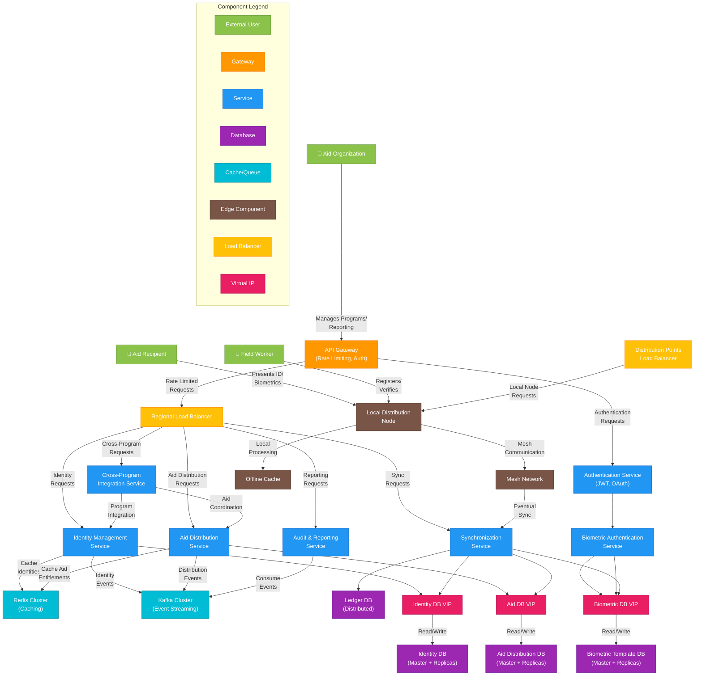

# 6-Task. Food distribution

### Functional Requirements

1. Identity Management
2. Aid Distribution
3. Synchronization
4. Reporting & Auditing
5. Cross-Program Integration

### Non-Functional Requirements

1. Support registration process completion within 5 minutes per recipient
2. Verify identity within 30 seconds
3. Process aid distribution transaction within 10 seconds
4. Handle at least 100 concurrent users per local node
5. Support up to 500,000 recipients per regional deployment
6. Handle up to 10,000 aid distribution transactions daily per regional node
7. Ensure 99.9% system availability at local distribution points
8. Function fully in offline mode for at least 7 days
9. Recover automatically after network reconnection
10. Encrypt all personal and biometric data at rest and in transit

### CAP Theorem

Availability has more priority than consistency

For humanitarian aid system, we need to make trade offs:

In humanitarian crises, nodes must continue functioning even when disconnected from the network, and aid distribution cannot halt due to connectivity issues. We use eventual consistency where transactions made during offline periods sync and reconcile when connectivity returns.

### Capacity

1. Average 500,000 recipients per regional deployment
2. 10,000 daily aid distribution transactions
3. 50 distribution points per region
4. Average 20 field workers per distribution point
5. Biometric data approximately 500KB per recipient (combined templates)

### Storage

Per Recipient Data**:** 

1. Total per recipient: ~535KB
2. Biometric templates: 500KB
3. Identity metadata: 10KB, 
4. Transaction history (average 50 transactions): 25KB

Regional Storage:

1. Recipient data: 500,000 × 535KB = ~267.5GB
2. Blockchain/ledger data: ~50GB annually
3. Application and OS: ~20GB
4. Total regional storage: ~337.5GB

### Network

Local Distribution Operations:

1. Verification transaction: ~10KB
2. Aid distribution record: ~5KB
3. Peak bandwidth during operation: ~5Mbps

Synchronization Bandwidth:

1. Daily synchronization data (compressed): ~100MB
2. Recommended sync bandwidth: ≥2Mbps when available
3. Minimum functional bandwidth: 256Kbps

## Core Design Principles

For this humanitarian aid distribution system, I'll design an architecture that:

1. Works offline in remote regions
2. Uses biometrics and digital IDs securely
3. Gives recipients ownership of their data
4. Enables cross-program ID usage
5. Maintains trust without centralized control
6. Handles synchronization effectively

## System Architecture

I propose a decentralized architecture built on three key components:

### Self-Sovereign Identity (SSI) Framework

Self-sovereign identity gives recipients complete ownership of their digital identity:

1. **Digital Wallets**: Recipients receive a smartphone app or physical smart card containing their encrypted biometric data and aid entitlements
2. **Biometric Verification**: Fingerprints, iris scans, and facial recognition (offering alternatives since some recipients may have physical conditions affecting certain biometrics)
3. **Zero-Knowledge Proofs**: Recipients can prove eligibility without revealing all personal data
4. **Verifiable Credentials**: Digital certificates from trusted aid organizations

### Distributed Ledger Technology (Modified Blockchain)

To maintain trust without centralized control:

1. **Private, Permissioned Ledger**: Only authorized aid organizations can validate transactions
2. **Lightweight Consensus**: Using Practical Byzantine Fault Tolerance (PBFT) or similar mechanisms that don't require intensive computation
3. **Smart Contracts**: Automated distribution rules ensuring fairness and preventing duplicate aid
4. **Immutable Audit Trail**: All aid distributions permanently recorded for transparency

### Mesh Network Infrastructure

For offline operation and eventual synchronization:

1. **Local Node Deployment**: Field offices run full nodes on small, rugged servers (like Raspberry Pi)
2. **Mobile Distribution Units**: Equipped with tablets/smartphones running lightweight nodes
3. **Low-Power Mesh Networks**: Using technologies like LoRa or similar for local communication
4. **Eventual Consistency**: Local transactions sync when connectivity is available

### Implementation Flow

1. Volunteer collects minimal required data and biometrics
2. System generates cryptographic keys for the recipient
3. Recipient receives digital wallet (via app or physical card)
4. Identity credentials issued as verifiable credentials

**Aid Distribution**:

1. Recipient presents digital ID at distribution point
2. Offline verification through biometrics against wallet
3. Smart contract checks eligibility and previous distributions
4. Transaction recorded locally, receipt provided to recipient
5. Distribution details stored in local node

**Synchronization Process**:

1. When connectivity is available, local nodes sync with regional nodes
2. Conflict resolution protocols handle any duplicate registrations
3. Data propagates through the network with cryptographic verification
4. Global state updated without compromising recipient privacy

**Cross-Program Integration**:

1. Standard API allows different aid programs to verify recipient identity
2. Recipients control what data is shared with which programs
3. Federated discovery system allows finding recipients across programs without central database

## Privacy and Security Measures

1. **Data Minimization**: Only absolutely necessary information collected
2. **Encrypted Storage**: All personal data encrypted at rest and in transit
3. **Compartmentalization**: Biometric templates stored separately from identity information
4. **Revocation Mechanisms**: Ability to revoke compromised credentials
5. **Multi-factor Authentication**: For system administrators and volunteers

## Challenges and Mitigations

1. **Technical Literacy**: Many recipients may have limited tech experience
    
    Solution: Simple interfaces, physical ID options, trained local guides
    
2. **Hardware Requirements**: Access to devices for verification
    
    Solution: low-cost devices with long battery life; shared community devices
    
3. **Synchronization Conflicts**: Multiple offline systems may create conflicts
    
    Solution: Versioning system with clear conflict resolution protocols
    
4. **Trust Building**: Recipients must trust the digital system
    
    Solution: Transparent operations, community oversight committees, clear privacy policies

### C4 diagram

